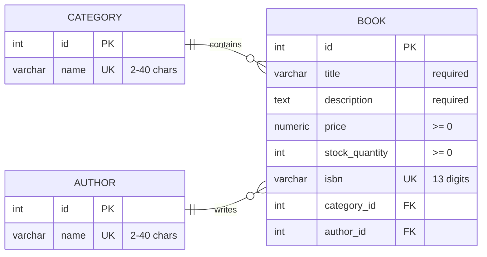

# Bookstore Inventory Application

This application lets users browse categories, authors, and books, and manage inventory records through a server-rendered interface.

## Features

- Browse categories, authors, and books
- Create, edit, and delete books, categories, and authors
- Prevent deleting a category or author that still has linked books
- Render custom not-found and error pages

## Tech Stack

- [Node.js](https://nodejs.org)
- [Express](https://expressjs.com)
- [EJS](https://ejs.co)
- [PostgreSQL](https://www.postgresql.org)
- [express-validator](https://express-validator.github.io/docs)
- [dotenv](https://github.com/motdotla/dotenv)

## Data Model



## Getting Started

### 1. Install dependencies

```bash
npm install
```

### 2. Create the PostgreSQL database

```sql
CREATE DATABASE bookstore_inventory;
```

### 3. Create a `.env` file

Use `.env.example` as a reference.

Example:

```env
PORT=3000
DB_HOST=localhost
DB_PORT=5432
DB_NAME=bookstore_inventory
DB_USER=your_postgres_user
DB_PASSWORD=your_postgres_password
```

### 4. Create tables and seed sample data

> [!IMPORTANT]
> `npm run db:seed` creates the schema and inserts sample data for local development.
>
> Seed data includes:
>
> - 3 categories
> - 6 authors
> - 8 books

> [!CAUTION]
> This script truncates existing data and resets IDs before inserting the sample records.

```bash
npm run db:seed
```

### 5. Start the application

```bash
npm run dev
```

Then open:

```text
http://localhost:3000
```
